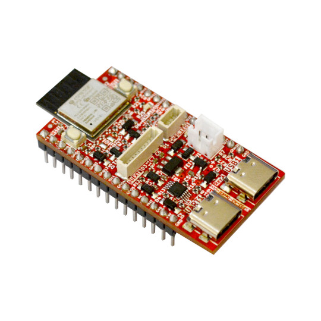

# ESP32-H2-DevKit-Lipo
Development board for ESP32-H2 SOC with BLE5 Matter, Thread, Zigbee

https://www.olimex.com/Products/IoT/ESP32-H2/ESP32-H2-DevKit-LiPo/open-source-hardware

Features:

* ESP32-H1-MINI-1-N4 module
* USB-C with USB to Serial converter for programming / debugging
* USB-C connected directly to ESP32-H2
* LiPo battery charger and connector
* pUEXT connector
* Qwiic/Stemma connector
* Reset button
* User button
* User LED
* all GPIOs available on two headers at 25.4 mm space
* operating temperature -40+85C
* Dimensions: 48 x 25 mm

## Licenses

* Hardware is released under CERN Open Hardware Licence Version 2 - Strongly Reciprocal, all silkscreen credits to Olimex should remain;
* Software is released under GPL3 Licensee
* Documentation is released under CC BY-SA 3.0
